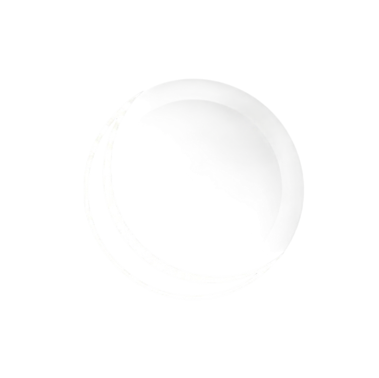

<p align="center">
  
</p>

<h1 align="center">CREST</h1>
<p align="center"><em>Compact Real-time Embedded SysTem</em></p>

<p align="center">
  
  
  
  
</p>

---

## What is this?

Hey, I'm Dragos — and this is my attempt to truly understand how operating systems work by building one myself, from scratch, for a real microcontroller.

No HAL. No newlib. No abstractions hiding the interesting parts. Just bare metal C, a linker script, and a lot of reading ARM reference manuals.

CREST is where I learn what actually happens when a task switches, how memory gets carved out of nothing, how the hardware interacts with software at the interrupt level. Every component here — the scheduler, the allocator, the mutex, the context switch — I either wrote myself or worked through until I understood it well enough to explain it.

This is a living project. As I keep learning I'll add more boards, more features, and go deeper into the parts I haven't touched yet.

---

## What's implemented

| Component | Description |
|---|---|
| **Preemptive scheduler** | Priority-based (0–7) with round-robin fairness at each level |
| **Context switch** | Naked PendSV handler; saves/restores R4–R11 on the process stack |
| **Heap allocator** | First-fit free list with split, coalesce, and PRIMASK protection |
| **Task management** | `task_create` / `task_delete` / `task_delay` / `task_yield` |
| **Mutex** | Binary mutex with owner tracking and a wait list |
| **Semaphore** | Counting semaphore; `sem_give` is ISR-safe |
| **UART logger** | Polling UART driver on USART2 (PA2/PA3) |
| **Custom libc** | `memset`, `memcpy`, `strncpy`, `snprintf` / `vsnprintf` — no newlib |

---

## Project structure

```
crest-rtos/
├── arch/
│   └── arm/cortex-m4/      # PendSV handler, port_start_first_task, critical sections
├── boards/
│   └── stm32f446/          # Startup, linker script, UART driver, main
├── cmake/
│   ├── toolchains/         # arm-none-eabi GCC toolchain file
│   └── boards/             # Per-board CPU flags and source lists
├── kernel/
│   ├── include/            # Public headers (task, sched, port, isr, alloc, mutex, semaphore)
│   ├── task.c              # Task lifecycle
│   ├── sched.c             # Scheduler (priority + round-robin)
│   ├── alloc.c             # Heap allocator
│   ├── mutex.c
│   ├── semaphore.c
│   └── libc_stubs.c
└── docs/
    └── SCHEDULER.md        # Scheduler design and algorithm walkthrough
```

---

## Building

Requires `cmake >= 3.16` and the `arm-none-eabi-gcc` toolchain.

```bash
# Build (default board: stm32f446)
./build.sh

# Build + flash via ST-Link
./build.sh -f

# Debug build (no optimisation)
./build.sh -d

# Clean rebuild
./build.sh -c

# All options
./build.sh -h
```

CMake directly:

```bash
cmake -S . -B build -DBOARD=stm32f446
cmake --build build -j$(nproc)
cmake --build build --target flash   # requires OpenOCD
```

---

## Adding a new board

1. Create `cmake/boards/<name>.cmake` — set `CREST_ARCH`, `CREST_CPU_FLAGS`, `CREST_LINKER_SCRIPT`, `CREST_BOARD_SOURCES`, `CREST_BOARD_INCLUDES`
2. Create `boards/<name>/` with at minimum `startup.c`, `link.ld`, and a UART driver
3. Pass `-b <name>` to `build.sh`

No changes to `CMakeLists.txt` needed.

---

## Contributing

If you're into embedded systems, low-level C, or just curious about how any of this works, there are a few ways to get involved:

- **Issues** — bug reports, questions, ideas for things to explore next
- **Discussions** — for broader conversations, questions about the design, or anything that isn't a concrete bug
- **Pull Requests** — if you want to contribute code, fix something, or add support for a new board

This is a learning project so no contribution is too small. Even just pointing out something that doesn't make sense is helpful.
